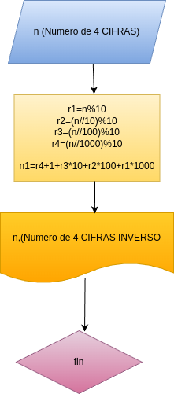

# Analisis

### Variable de Entrada
- n: Numero Base de 4 cifras

### Procesamiento
- r1: Cuatro/Ultimo Dijito
- r2: Tercer Dijito
- r3: Segundo Dijito
- r4: Primer Dijito

r1=n%10
r2=(n//10)%10
r3=(n//100)%10
r4=(n//1000)%10

$ni=r4*2+r3*10+r2*100+r1*1000$

## Diseño

## Construccion

- codigo implementado en el archivo
"invertir_numero.py"